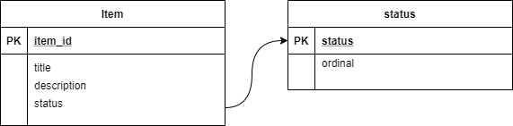
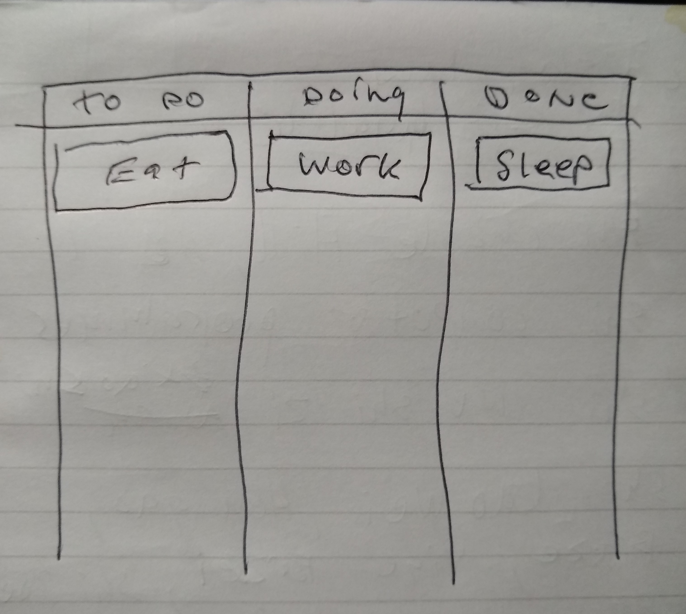

# kanban front end
Project with sample kanban UI / Front Ends in various frontend languages and framework

## Why
Demonstrate implementation of front end in different languages and frameworks. The idea is that the code can be re-used in your own organization, so you don't have to pay for trello, asana and other external kanban boards.

## How
Sample front end implementation (wireframe) of a minimal kanban or scrum board, based on the sample datamodel

### Data Model


### Sample json (items)

```

[
    {
        "item_id": 1,
        "title": "Eat",
        "description": "Buy food and consume it",
        "status" : "To do",
        "ordinal": 1
    },
    {
        "item_id": 2,
        "title": "Sleep",
        "description": "Find bed and close eyes",
        "status" : "Done",
        "ordinal": 2
    },
    {
        "item_id": 3,
        "title": "Work",
        "description": "Go do something to get paid",
        "status" : "Doing",
        "ordinal": 3
    }
]

```

### Sample json (status)

```

[
    {
        "status": "To do",
        "ordinal": 1
    },
    {
        "status": "Doing",
        "ordinal": 2
    },
    {
        "status": "Done",
        "ordinal": 3
    }
]

```

### Wireframe 
Drawing for the UI for the sample data



### User Interactions

i1 : Item  
i1.1 : View : Items shall be shown/hidden by status, ordinal on the board. 2 x clicking an item will pop up the title+description detail view  
i1.2 : Add : Items can be added, in a given swimlane  
i1.3 : Update : Title shall be editable inline via one click, and in detail view via (2xc). The location (ordinal) and status can be edited by drag and drop  
i1.4 : Delete : Deleted items will be moved to trash (soft delete)  
i1.5 : Archive : Archived items will change status to 'Archived' a hidden list  
  
i2 : Status  
i2.1 : View : Status is sorted by ordinal and location. There is no detail view of status  
i1.2 : Add : Adding a status will create a new swimlane / column  
i1.3 : Update : Status shall be editable inline. The location (ordinal) and status can be edited by drag and drop  
i1.4 : Delete : Deleted staus will be moved to trash together will the items in the status (soft delete)  
i1.5 : Archive : Archived status will change item status to 'Archived' a hidden list  

